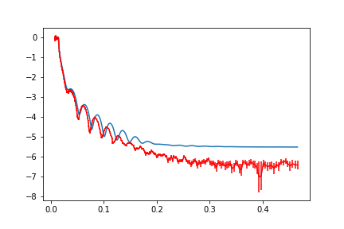
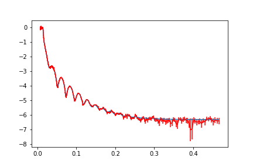
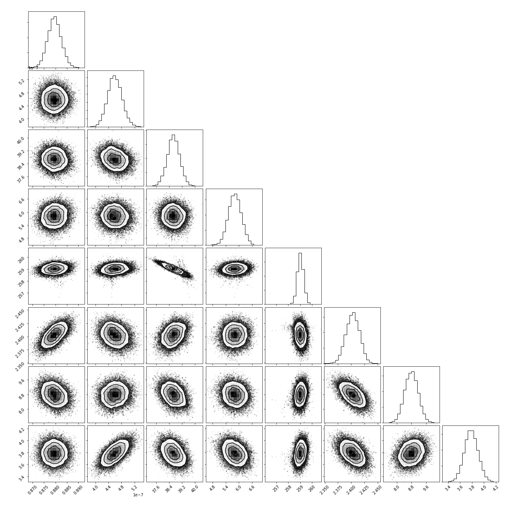
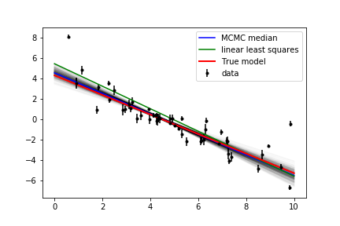
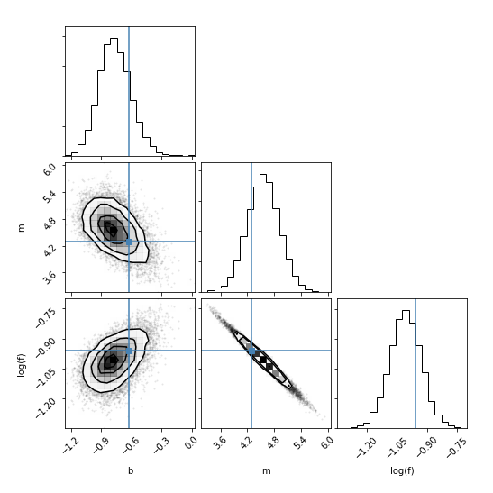

.. _gettingstarted_chapter:

===================================
Getting started
===================================

.. _Github:   https://github.com/refnx/refnx/blob/master/examples/reflectometry_analysis.ipynb
.. _emcee documentation: http://emcee.readthedocs.io/en/stable/user/line.html
.. _scipy.optimize:      http://docs.scipy.org/doc/scipy/reference/optimize.html

Fitting a neutron reflectometry dataset
=======================================

This example analyses a neutron reflectometry dataset, you can find this
example on `Github`_. Start off with relevant imports:

.. code:: python

    import numpy as np
    from refnx.analysis import Objective, CurveFitter, Parameter, Transform
    from refnx.analysis import process_chain
    from refnx.reflect import Slab, SLD, ReflectModel
    from refnx.dataset import ReflectDataset

Load some data

.. code:: python

    data = ReflectDataset('c_PLP0011859_q.txt')

Set up the SLD's for the model

.. code:: python

    si = SLD(2.07, name='Si')
    sio2 = SLD(3.47, name='SiO2')
    film = SLD(2.0, name='film')
    d2o = SLD(6.36, name='d2o')

Create some slabs. The sio2 oxide layer is 30 Å thick with a 3 Å roughness.

.. code:: python

    sio2_layer = sio2(30, 3)
    sio2_layer.thick.setp(bounds=(15, 50), vary=True)
    sio2_layer.rough.setp(bounds=(1, 15), vary=True)

    film_layer = film(250, 3)
    film_layer.thick.setp(bounds=(200, 300), vary=True)
    film_layer.sld.real.setp(bounds=(0.1, 3), vary=True)
    film_layer.rough.setp(bounds=(1, 15), vary=True)

    d2o_layer = d2o(0, 3)
    d2o_layer.rough.setp(vary=True, bounds=(1, 15))

Make a Structure from Slab components

.. code:: python

    structure = si | sio2_layer | film_layer | d2o_layer

Setup a reflectivity model from the structure

.. code:: python

    model = ReflectModel(structure, bkg=3e-6)
    model.scale.setp(bounds=(0.6, 1.2), vary=True)
    model.bkg.setp(bounds=(1e-9, 9e-6), vary=True)

An Objective requires a Model and a Data1D object. The transform kwd says that
we want to fit as logY vs X. Lets also plot it (requires matplotlib be
installed).

.. code:: python

    objective = Objective(model, data, transform=Transform('logY'))
    fig, ax = objective.plot()

Once we have an Objective we can create a CurveFitter. Do a quick fit with the
'differential_evolution' solver.

.. code:: python

    fitter = CurveFitter(objective)
    fitter.fit('differential_evolution')

Now lets do some MCMC sampling with the CurveFitter object.

.. code:: python

    fitter.sample(1000)

Before we can use the results we have to burn and thin to reduce correlation.

.. code:: python

    process_chain(objective, fitter.chain, nburn=400, nthin=50)

Look at the parameters and plot again.

.. code:: python

    print(objective)
    fig, ax = objective.plot()

Visualise the covariance with a corner plot (requires the corner package be
installed)

.. code:: python

    import corner
    corner.corner(fitter.sampler.flatchain)

Fitting a data to a user defined model
=======================================

Here we demonstrate a fit to a user defined model. This line example is taken
from the `emcee documentation`_ and the reader is referred to that link for
more detailed explanation. The errorbars are underestimated, and the modelling
will account for that.

Synthesise data:

.. code:: python

    import numpy as np
    np.random.seed(123)

    # Choose the "true" parameters.
    m_true = -0.9594
    b_true = 4.294
    f_true = 0.534

    N = 50
    x = np.sort(10*np.random.rand(N))
    yerr = 0.1+0.5*np.random.rand(N)
    y = m_true*x+b_true
    y += np.abs(f_true*y) * np.random.randn(N)
    y += yerr * np.random.randn(N)

To use *refnx* we need first need to create a dataset.

.. code:: python

    from refnx.dataset import Data1D
    data = Data1D(data=(x, y, yerr))

Then we need to set up a generative model.

.. code:: python

    from refnx.analysis import Model, Objective, Parameter

    def line(x, params, *args, **kwds):
        p_arr = np.array(params)
        return p_arr[0] + x * p_arr[1]

    # the model needs parameters
    p = Parameter(1, 'b', vary=True, bounds=(0, 10))
    p |= Parameter(-2, 'm', vary=True, bounds=(-5, 0.5))

    model = Model(p, fitfunc=line)

Now we create an objective from the mode and the data. We use an extra
parameter, lnsigma, to describe the underestimated error bars.

.. code:: python

    lnf = Parameter(0, 'lnf', vary=True, bounds=(-10, 1))
    objective = Objective(model, data, lnsigma=lnf)

Finally a CurveFitter.

.. code:: python

    from refnx.analysis import CurveFitter, process_chain
    fitter = CurveFitter(objective)

    # get max likelihood
    fitter.fit('differential_evolution')

    # sample
    fitter.sample(1000)

    # burn the first 100, and thin by 15.
    process_chain(objective, fitter.chain, nburn=100, nthin=15, flatchain=True)

    print(objective)

.. parsed-literal::

    ________________________________________________________________________________
    Objective - 111850645096
    Dataset = <refnx.dataset.data1d.Data1D object at 0x10796ef60>
    datapoints = 50
    chi2 = 45.03473215559118
    Weighted = True
    Transform = None
    ________________________________________________________________________________
    Parameters:      None
    <Parameter:     'lnf'     value=   -0.769326    +/- 0.156, bounds=[-10, 1]>
    ________________________________________________________________________________
    Parameters:      None
    <Parameter:      'b'      value=    4.5473      +/- 0.36 , bounds=[0, 10]>
    <Parameter:      'm'      value=   -1.00738     +/- 0.0788, bounds=[-5, 0.5]>

Here's the data. The true model is shown, along with the model from the median
of the MCMC parameters, 500 samples from the MCMC chain, and the linear least
squares fit. Note how close the median MCMC estimated model is to the 'true'
behaviour. See how far off the linear least squares fit is, if you don't take
into account the underestimated error bars.

.. code:: python

    # get the least squares fit
    A = np.vstack((np.ones_like(x), x)).T
    C = np.diag(yerr * yerr)
    cov = np.linalg.inv(np.dot(A.T, np.linalg.solve(C, A)))
    b_ls, m_ls = np.dot(cov, np.dot(A.T, np.linalg.solve(C, y)))

    import matplotlib.pyplot as plt
    xl = np.array([0, 10])

    for lnf, b, m in objective.pgen(500):
        plt.plot(xl, m*xl+b, color="k", alpha=0.01)
    plt.plot(xl, model(xl), color='blue', label=('MCMC median'))
    plt.plot(xl, model(xl, [b_ls, m_ls]), color='green', label=('linear least squares'))
    plt.plot(xl, m_true*xl+b_true, color="r", lw=2, alpha=1.0, label='True model')
    plt.errorbar(x, y, yerr=yerr, fmt=".k", label='data')
    plt.legend()

Here's a corner plot of the results

.. code:: python

    import corner
    labels = ['b', 'm', 'log(f)']
    fig = corner.corner(fitter.sampler.flatchain,
                        labels=labels,
                        truths=[np.log(f_true), b_true, m_true]);

