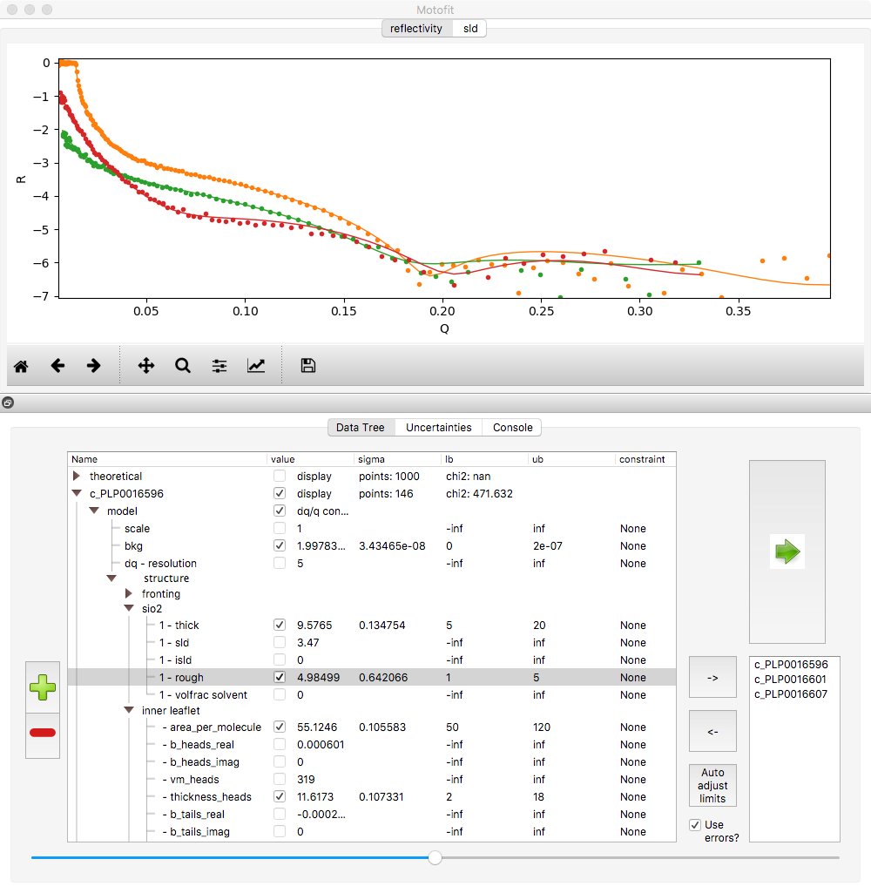

.. _gui_chapter:

===
GUI
===

.. _YouTube:     https://www.youtube.com/channel/UCvhOxwZsdFMGqSzasE0ZSOw
.. _github:     https://github.com/refnx/refnx/releases/latest

*refnx* offers a sophisticated *PyQt* graphical user interface to analyse data,
with pre-built executables available on `github`_. The gui can also be
started from the interpreter (requiring the *pyqt5, periodictable, matplotlib*
packages to be installed):

    ::

     >>> from refnx.reflect import gui
     >>> gui()

There are tutorials on how to use the PyQt interface on `YouTube`_. Suggestions
for more tutorials are welcomed.

